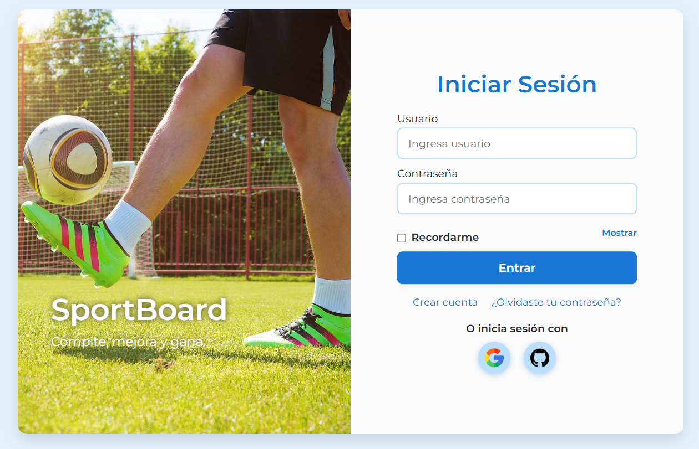

# Proyecto Maqueta Web: Login, Dashboard y Menú

## Descripción
Este proyecto consiste en la creación de una maqueta web que incluye las vistas de:

- Login
- Dashboard
- Menú

La maqueta se generó a partir de un diseño hecho en Figma, y se adaptaron los estilos usando CSS para lograr una interfaz limpia y funcional.

## Pasos realizados

1. **Creación de imágenes de referencia:**  
   Se generaron algunas imágenes como referencia utilizando Stitch, una IA que ayuda en el diseño.

2. **Diseño en Figma:**  
   Se creó un diseño visual para las tres vistas principales: login, dashboard y menú.

3. **Maquetación HTML:**  
   Se generaron los archivos HTML correspondientes para cada vista, respetando la estructura definida en Figma.

4. **Adaptación de estilos CSS:**  
   Se desarrollaron estilos CSS personalizados para dar formato y apariencia visual a las vistas, siguiendo el diseño original.

5. **Interactividad con JavaScript:**  
   Se añadió funcionalidad para cambiar entre formularios (login, registro, recuperación de contraseña) y toggles en los campos de contraseña.

6. **Repositorio en GitHub:**  
   Se subió el código al repositorio para control de versiones y colaboración.

---

## Vista de ejemplo

